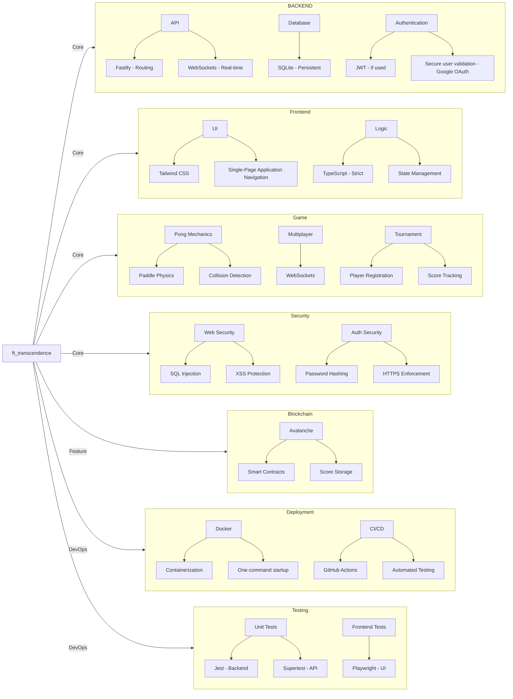
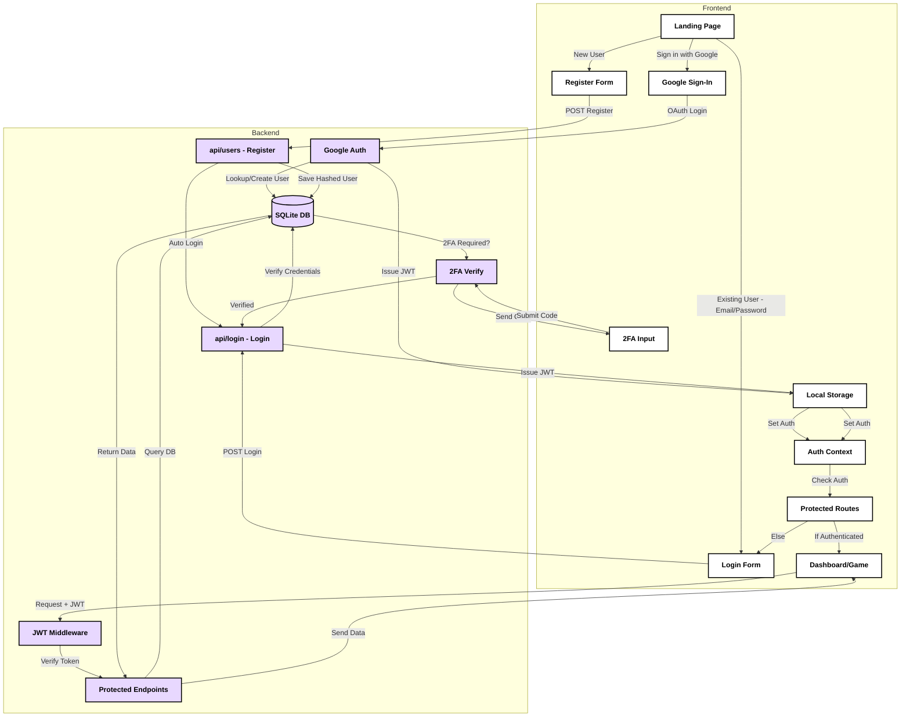
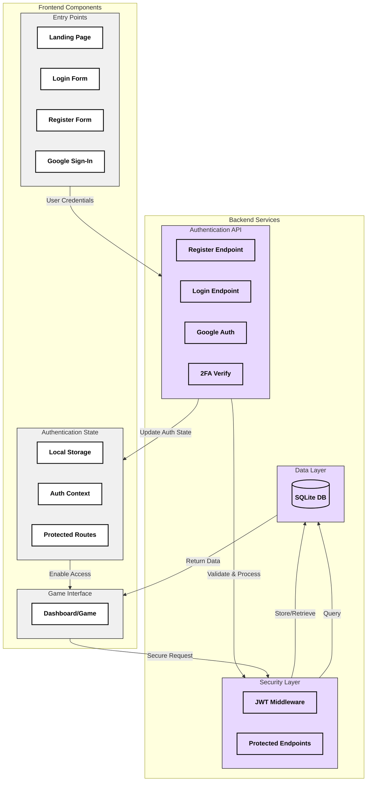

# ft_transcendence

## 📋 Table of Contents
- [Overview](#overview)
- [Team](#team)
- [Features](#features)
- [Chosen Modules](#chosen-modules)
- [Technology Stack](#technology-stack)
- [Installation & Setup](#installation--setup)
- [Project Structure](#project-structure)
- [Development Guidelines](#development-guidelines)
- [Roadmap](#roadmap)
- [Authentication System Architecture](#authentication-system-architecture)

## Overview

ft_transcendence is a web-based multiplayer Pong game that integrates real-time gameplay with modern web technologies. Developed as part of our Hive Helsinki project, it pushes us to adapt to new technologies and implement a secure, scalable, and interactive application.

## Team

We are a team of five developers working together to complete this project within a two-month timeframe (01.04 - 01.06). Our focus is on designing an engaging gaming experience while ensuring security and performance best practices.

### Developers
- [Miyuki Ito](https://github.com/ito-miyuki)
- [Kim Matjuhin](https://github.com/k2matu)
- [Valle Vaalanti](https://github.com/Vallehtelia)
- [Oliver Hertzberg](https://github.com/oliverhertzberg)
- [Lumi Kilpeläinen](https://github.com/lkilpela)

## Features

### Core Features
- 🎮 **Pong Gameplay**: Play 1v1 Pong matches & multiplayers locally
- 🔐 **User Management**: Registration, authentication, and user profiles
- 🏆 **Tournament System**: Matchmaking, leaderboards, and competitive play
- 🛡️ **Security**: HTTPS enforcement, input validation, hashed passwords, and protection against SQL injection and XSS
- 🐳 **Dockerized Deployment**: Easy setup with a single command

## Chosen Modules

### Web
- ✅ **Major**: Use a framework to build the backend
- ✅ **Minor**: Use a framework or toolkit to build the frontend
- ✅ **Minor**: Use a database for the backend
- ✅ **Major**: Store the score of a tournament in the Blockchain

### User Management
- ✅ **Major**: Standard user management, authentication, users across tournaments
- ✅ **Major**: Implementing remote authentication

### Gameplay & User Experience
- ✅ **Major**: Multiplayer (more than 2 players in the same game)
- ✅ **Major**: Add another game with user history and matchmaking
- 🎯 **Nice to Have**: Live chat

### Cybersecurity
- ✅ **Major**: Implement Two-Factor Authentication (2FA) and JWT

### Accessibility
- ✅ **Minor**: Expanding browser compatibility
- ✅ **Minor**: Supports multiple languages

## Project Architecture

## Technology Stack

### Frontend
- TypeScript
- React
- Tailwind CSS

### Backend
- Fastify
- Node.js
- SQLite

### DevOps
- Docker
- GitHub Actions

### Security
- HTTPS
- JWT authentication
- Secure credential storage

## Installation & Setup

1. Clone the repository
2. Run `docker-compose up`
3. Access the application at `http://localhost:xxxx/` (port to be confirmed)

## Development Guidelines

- Follow coding standards and best practices
- Use Git for version control with meaningful commit messages
- Ensure project security and compliance
- Peer-review all contributions before merging

## Roadmap

| Phase | Duration | Tasks |
|-------|----------|-------|
| Planning | Week 1-2 | Initial setup, project planning, architecture decisions |
| Development | Week 3-4 | Core game mechanics, authentication, database integration |
| Enhancement | Week 5-6 | Gameplay improvements, additional features, security implementation |
| Finalization | Week 7-8 | Testing, debugging, and deployment |

## Authentication System Architecture

